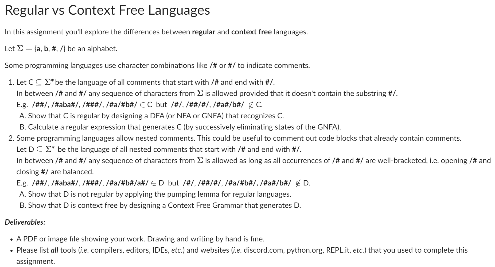

Designing DFA/NFA/GNFA (Part 1):
Start by identifying key elements of a regular language:

States to handle the start (/#), intermediate characters, and end (#/).
Transitions that prevent the invalid #/ from appearing inside the comment.
The DFA/NFA should accept strings that fit the pattern and reject those that don't.
Pumping Lemma (Part 2A): The pumping lemma is used to show that for any regular language, there is a length p where strings longer than p can be "pumped" without violating the language rules. Choose a string from D that violates the pumping lemma when manipulated.

Context-Free Grammar (Part 2B): The CFG should recursively allow nesting of /# and #/. For example, the rule might look like:

S -> /# S #/ | a | b | ε
Where S represents a string that can either be a nested comment or terminal symbols (a, b, etc.).


---

## **Part 1: Language C - Regular Language**

### **Step 1: Define the Problem**
- The language C is for comments that start with `/#` and end with `#/`.
- **Key Condition:** In between `/#` and `#/`, any sequence of characters is allowed **except for the substring `#/`**. This is because `#/` would terminate the comment early.

#### **Example (Valid):**
- `/#abc#/`  
- `/#a#b#/`
- `/#ab#c#/`

#### **Example (Invalid):**
- `/#/`  (Nothing in between the delimiters)
- `/#abc#/def#/`  (This has an extra `#/` inside, which isn’t allowed)

--------------------------------------

### **Step 2: Task A - Design a DFA/NFA/GNFA for C**

1. **Start with the alphabet Σ**:  
   - The alphabet Σ = {a, b, #, /}. These are the characters you’ll use to build the DFA or NFA.
   
2. **Define the states**:
   - **Start State**: Where the DFA starts before seeing any characters.
   - **Reading characters inside the comment**: As soon as you read `/#`, you enter a state where any characters from Σ (except `#/`) can be read.
   - **Final State**: Once you see `#/` (the closing delimiter), you should transition to an accepting state (final state).

3. **State transitions**:
   - In the initial state, when you encounter `/#`, transition to the next state.
   - While in the intermediate state, you can read any symbols except `#/`. 
   - Once you reach the closing `#/`, transition to the final state and accept the string.

4. **Ensure correctness**:
   - The automaton should accept strings like `/#abc#/` and reject strings like `/#/` or those containing nested `#/`.
   - **Draw the DFA**: 
     - Start by drawing circles for states.
     - Label transitions for each input character.
     - Clearly show the start state and final accepting state.

---

### **Step 3: Task B - Calculate the Regular Expression for C**

1. **Think about the structure of valid comments**:
   - The regular expression must start with `/#`, followed by any combination of characters from Σ, and end with `#/`.

2. **Break it down**:
   - Start with the opening delimiter: `/#`
   - Follow it with any sequence of allowed characters (but make sure `#/` does not appear before the end).
   - End with the closing delimiter: `#/`.

3. **Construct the Regular Expression**:
   - A possible regular expression could be:
     ```
     /\#[a-b/#]*\#/
     ```
   - This allows any combination of characters `a`, `b`, `/`, and `#`, provided the sequence starts with `/#` and ends with `#/`.


## **Part 2: Language D - Nested Comments (Context-Free)**

### **Step 1: Define the Problem**
- The language D is for **nested comments**. That is, comments where `/#` and `#/` are properly balanced.
- You’re allowed to have comments like `/#abc/#xyz#/abc#/`, but you must ensure that the nesting is **balanced**.

#### **Example (Valid):**
- `/#abc/#xyz#/abc#/`
- `/#a#b#/`

#### **Example (Invalid):**
- `/#/`  (Nothing in between)
- `/#abc/#/def#/`  (Improper nesting)


### **Step 2: Task A - Show D is Not Regular (Use the Pumping Lemma)**

1. **Recall the Pumping Lemma**:
   - The pumping lemma states that for any regular language, there exists a length `p` such that any string `s` longer than `p` can be split into three parts: `s = xyz`, where:
     - For any integer `i`, the string `xy^iz` is still part of the language.
     - The length of `y` is at least 1.
     - The length of `xy` is at most `p`.

2. **Choose a string from D**:
   - Pick a string that is representative of D, such as `s = /#/#/#/#/`. This is a properly nested string.
   - Show that no matter how you "pump" the string (repeat parts of it), the result will no longer be in the language D because the balance between `/#` and `#/` will break.

3. **Conclusion**:
   - After attempting to apply the pumping lemma, demonstrate that it's impossible to "pump" the string without breaking the nesting, thereby proving that D is not regular.


### **Step 3: Task B - Show D is Context-Free (Design a Context-Free Grammar)**

1. **Understand the Grammar for Nesting**:
   - A **Context-Free Grammar (CFG)** allows recursive definitions, which are necessary for describing nested structures.

2. **Create Rules for the CFG**:
   - **S**: This will be your start symbol. It represents a valid string in D.
   - The grammar must:
     - Start and end with `/#` and `#/`.
     - Allow recursion for nesting (i.e., the ability to open new comments within existing comments).

3. **Example CFG**:
   ```
   S -> /# S #/ | a | b | ε
   ```
   - The first rule says that `S` can be another nested comment enclosed in `/#` and `#/`.
   - The second and third rules allow any string of `a`s or `b`s (your alphabet) inside the comments.
   - `ε` represents an empty string (i.e., a comment with no content).

4. **Validate the CFG**:
   - Check if the CFG generates all valid nested comments and rejects invalid ones.
